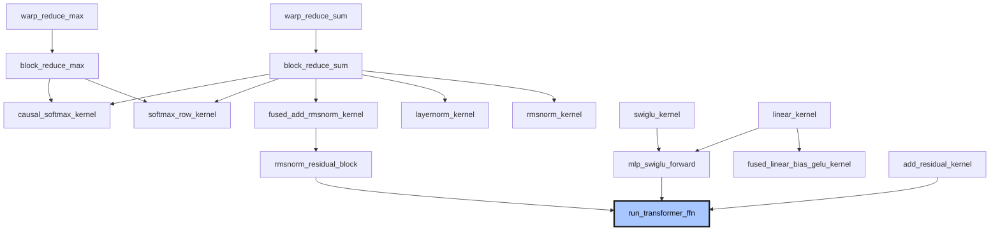

# Fused LLM Inference Kernels in CUDA

A CUDA kernel library implementing the core compute path of a transformer's feed-forward block — from warp-level primitives up to a fused, working forward pass.

```
residual_out = x + residual
out          = residual_out + SwiGLU_MLP(RMSNorm(residual_out))
```

## Architecture



Not pictured (independent utility kernels, not on the FFN path): `gelu_kernel`, `silu_kernel`, `embedding_lookup_kernel`, `rope_kernel`.

## Kernels

**Reductions** — `warp_reduce_sum`, `warp_reduce_max`, `block_reduce_sum`, `block_reduce_max`
Combine values across GPU threads using shuffle intrinsics and shared memory. The foundation every other kernel builds on.

**Activations** — `add_residual_kernel`, `gelu_kernel`, `silu_kernel`, `swiglu_kernel`
Elementwise skip connections and transformer MLP nonlinearities.

**Normalization** — `rmsnorm_kernel`, `layernorm_kernel`, `fused_add_rmsnorm_kernel`
Row-wise normalization, including a fused residual-add + RMSNorm kernel.

**Softmax** — `softmax_row_kernel`, `causal_softmax_kernel`
Numerically stable softmax with causal masking for attention.

**Embeddings & RoPE** — `embedding_lookup_kernel`, `rope_kernel`
Token embedding lookup and rotary positional embeddings.

**Linear layers** — `linear_kernel`, `fused_linear_bias_gelu_kernel`, `mlp_swiglu_forward`
Dense projections and the full SwiGLU MLP block.

**Composite blocks** — `rmsnorm_residual_block`, `run_transformer_ffn`
Everything above composed into the complete pre-norm FFN forward pass.

## Engineering highlights

- Warp-level reductions using `__shfl_xor_sync` — register-only, no memory traffic
- Kernel fusion (`fused_add_rmsnorm_kernel`, `fused_linear_bias_gelu_kernel`) to avoid extra global memory round-trips
- Numerically stable softmax via max-subtraction before `exp()`
- Ceiling division for correct handling of non-multiple-of-32 block sizes

## Verified output

Compiled and run independently with `nvcc`:

```
$ nvcc -o scaffold scaffold.cu -arch=sm_75
$ ./scaffold
FFN out[0..3]: 42.815037 33.395168 -21.104704 -0.468143
FFN out[last]: -43.480938
scaffold OK
```

## Run it

```bash
git clone https://github.com/intishar-rafi/Fused-LLM-Inference-Kernels-in-CUDA.git
cd Fused-LLM-Inference-Kernels-in-CUDA
nvcc -o scaffold scaffold.cu -arch=sm_75
./scaffold
```

## Files

- `model.cu` — all 20 kernels and host functions
- `scaffold.cu` — test harness driving the full pipeline
